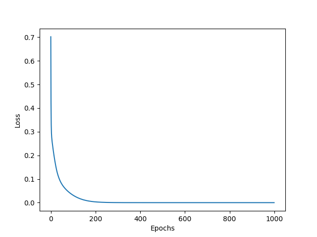

# Overview
A basic implementation of a neural network in Python, developed for educational purposes.

# Setup
- Install required packages: numpy, matplotlib, tqdm

# Model Architecture
- A neural network with multiple layers, including linear and activation layers
- Supports ReLU and LeakyReLU activation functions

# Features
- Implementation of forward and backward passes for each layer
- Supports training of the neural network using stochastic gradient descent (SGD)
- Able to plot the training loss over epochs using Matplotlib
- Custom implementation of MSE loss function

# Limitations
- This is a basic implementation and may not be optimized for performance
- Limited to a simple neural network architecture

# Usage
- Run main.py to train the neural network and visualize the training loss
- Adjust dataset and hyperparameters (e.g. learning rate, number of epochs) as needed

---
# Example
The provided example demonstrates the neural network's ability to learn the XOR (Exclusive OR) logic gate. The XOR dataset consists of 4 input-output pairs:
| Input 1 | Input 2 | Output |
| --- | --- | --- |
| 0     | 0     | 0     |
| 0     | 1     | 1     |
| 1     | 0     | 1     |
| 1     | 1     | 0     |

